#### 基础知识
- [Java 基础总结](src/README.md)
- [Enum 枚举](src/enum_s)
- [Generics 泛型](src/generics)

了解泛型

1.【重】理解泛型

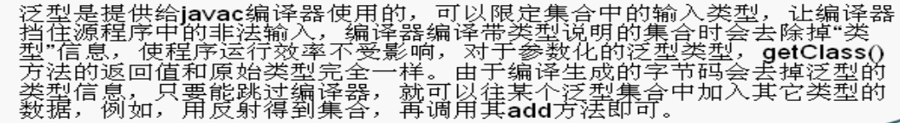

2.限定通配符

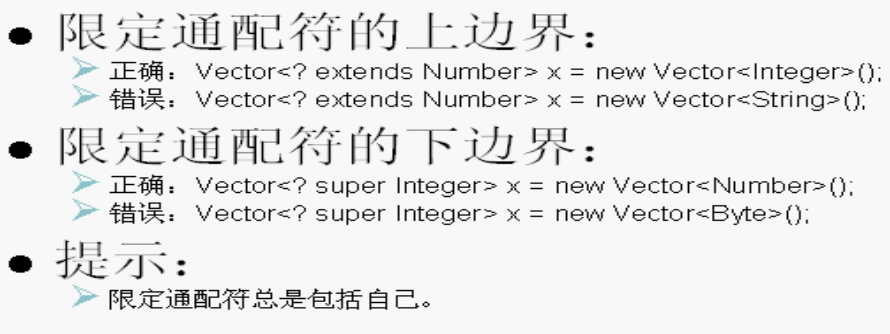

3.由C++模板函数引入自定义泛型

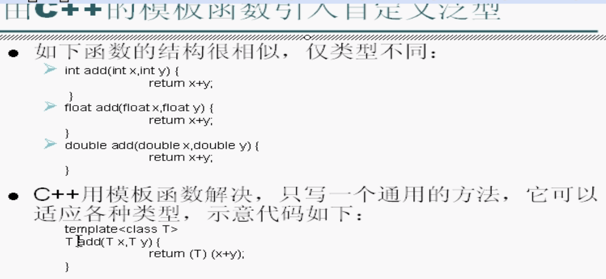

4.泛型练习题

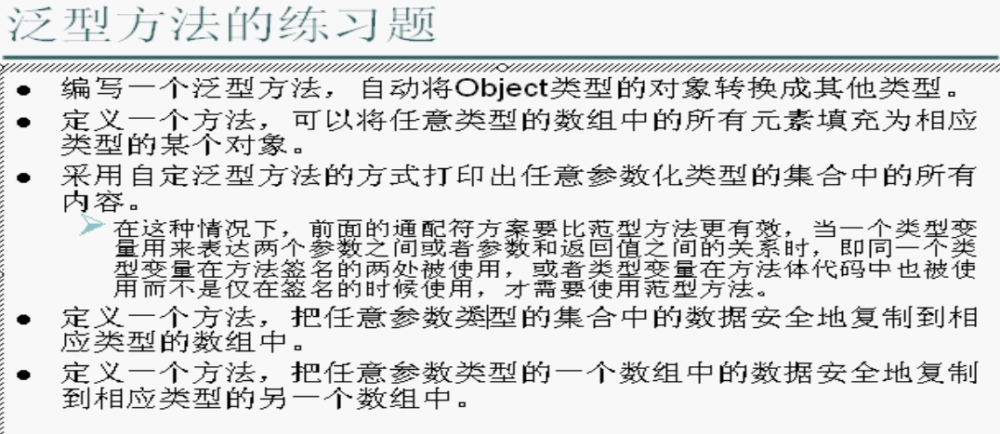

5.【难】泛型参数的类型推断

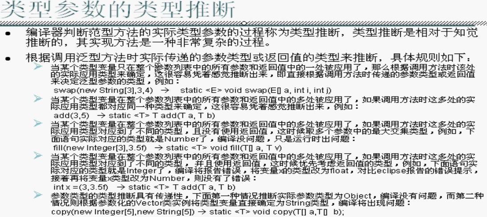

- [Reflect 反射](src/reflect_s)

反射实现框架的功能

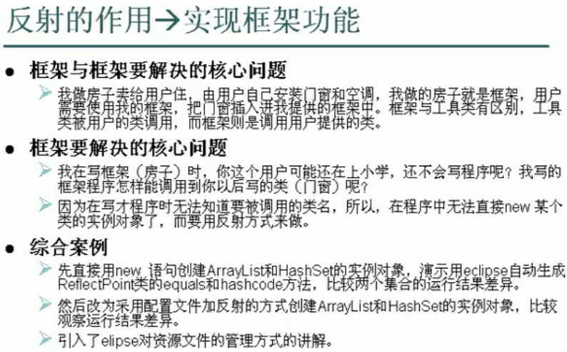

数组的反射

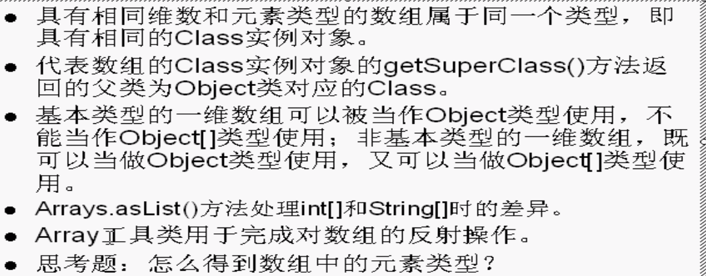

用反射方式执行某个类中的main方法

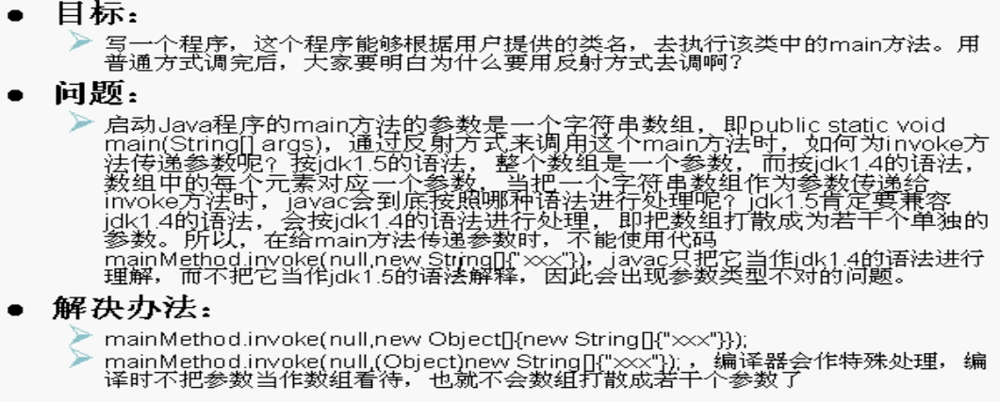

hashCode方法与HashSet类

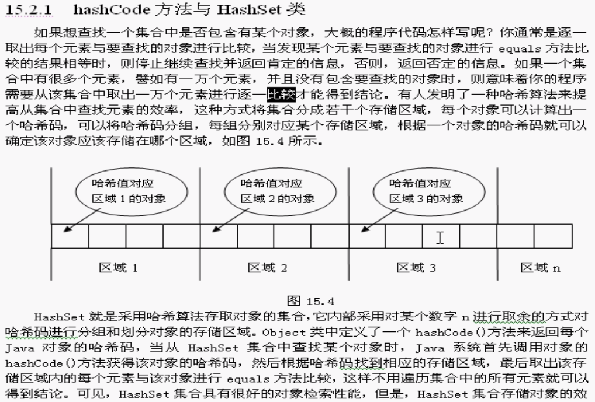

【重】HashSet造成的内存泄漏

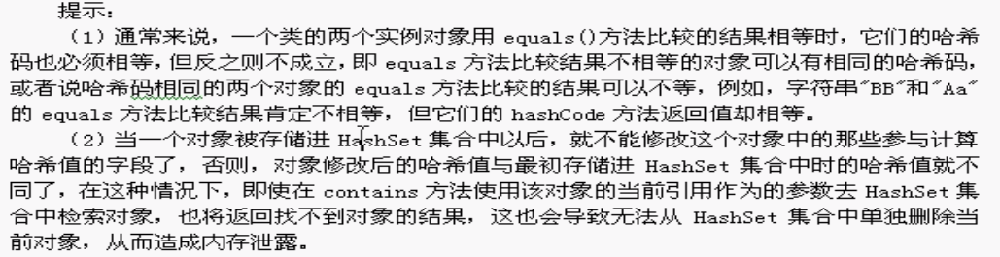

- [Reflect 反射--内省](src/reflect_s/内省)

内省

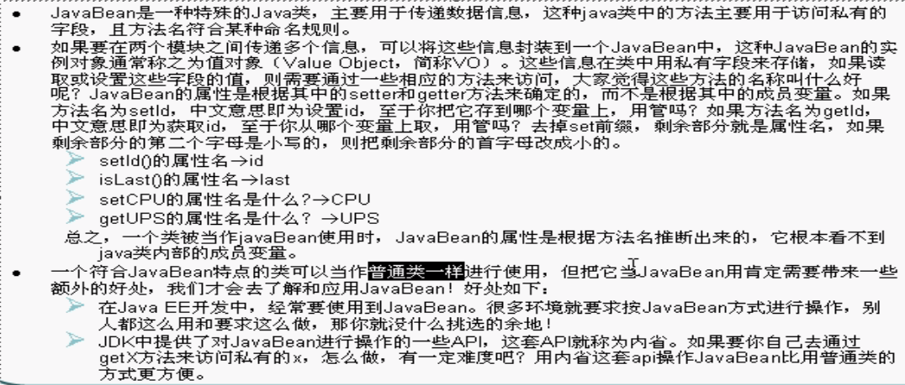

内省案例

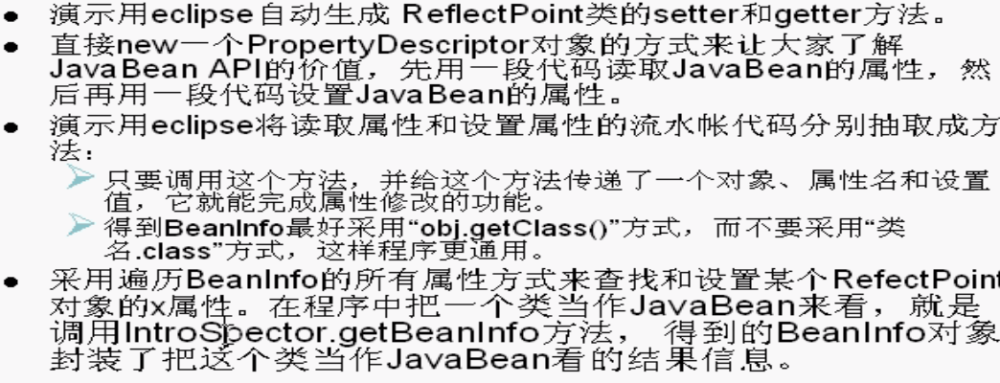

- [ArrayList](src/arraylist)
- [多线程](src/aop/thread)
- [HashMap与HashTable区别](src/basic/HashMap与HashTable区别.md)
- [char 类型](src/acer/char类型.md)
- [静态成员](src/acer/静态成员.md)
- [Oauth 认证协议原理](src/acer/Oauth认证协议原理.md)
- [onSaveInstanceState源码](src/acer/onSaveInstanceState源码.md)
- [RAM和ROM的区别](src/acer/RAM和ROM的区别.md)
- [Token 产生的意义](src/acer/Token产生的意义.md)
- [编译时和运行时](src/acer/编译时和运行时.md)
- [迭代开发的时候如何向前兼容新旧接口](src/acer/迭代开发的时候如何向前兼容新旧接口.md)
- [注解开发](src/annotation)
- [AOP 基本原理(附图)](src/aop/aopframework)

1.理解代理

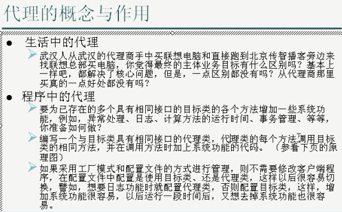

2.代理架构图

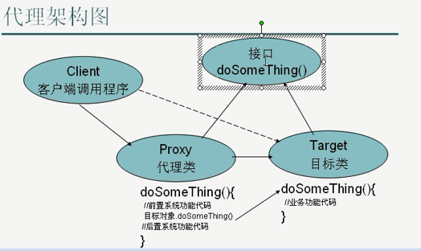

3.aop原理-代理proxy

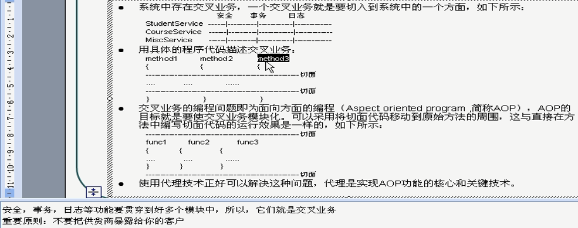

4.动态代理介绍

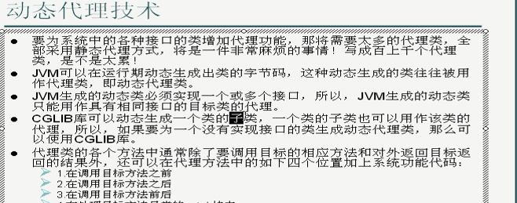

- [位运算符详解实例](src/basic/位运算符详解实例.md)
#### 设计模式
- [面向对象](src/design/oo/oo.md)
- [责任链模式](src/design/filter/责任链模式.md)
- [迭代器模式-容器与容器遍历](src/design/filter/容器与容器遍历.md)
- [代理模式](src/design/proxy)

代理模式例子

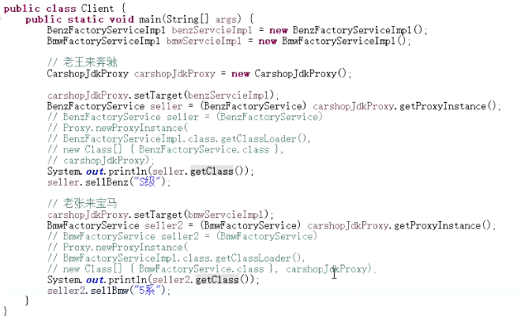

- [策略模式](src/design/strategy/策略模式.md)

#### JVM
- [Java内存模型](src/jvm/basic/Java内存模型.md)
- [JVM运行时数据区](src/jvm/basic/JVM运行时数据区.md)
- [类加载器及双亲委派](src/jvm/类加载器及双亲委派.md)

1_类加载器

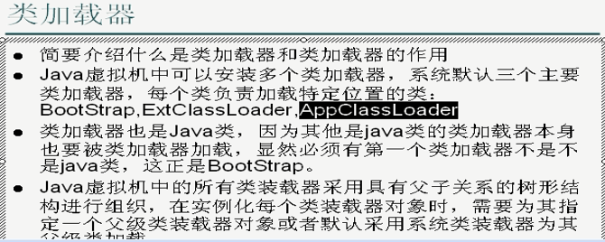

2_类加载器之间的关系

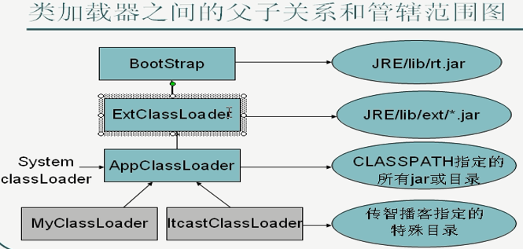

3_类加载器的委托机制

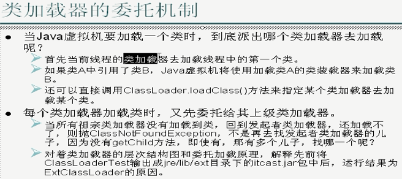

4_自定义类加载器

#### 多线程
- [Java中终止（销毁）线程的方法](src/thread_s/Java中终止（销毁）线程的方法.md)

#### 学习资源
- Java中级技术教程 http://yun.itheima.com/course/5.html
- Java多线程与并发库高级应用 http://yun.itheima.com/course/37.html