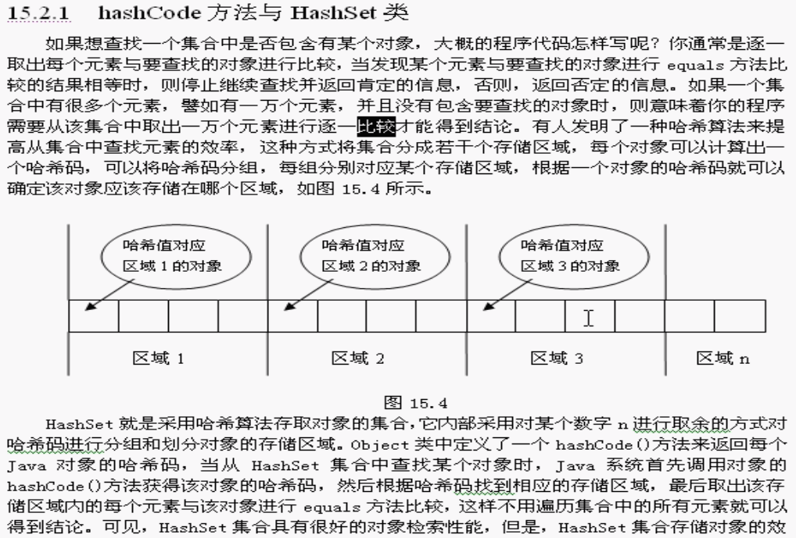
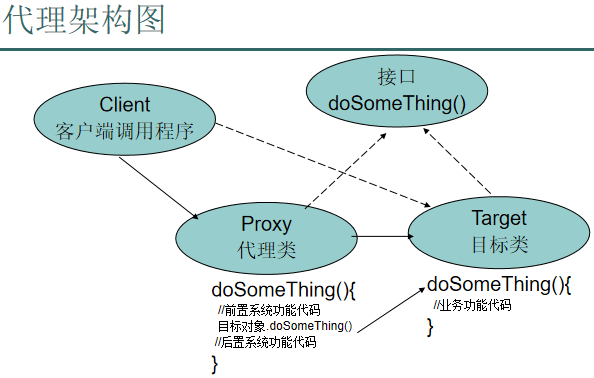
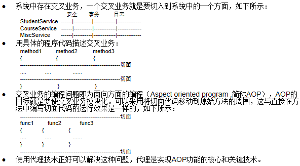
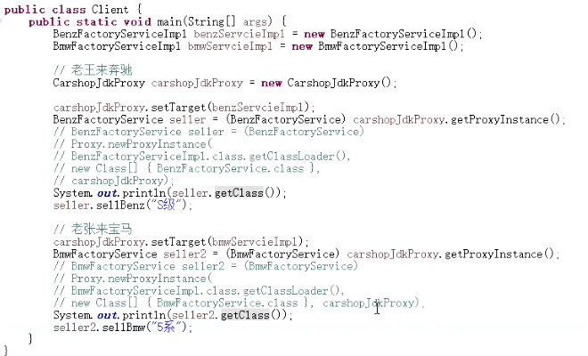
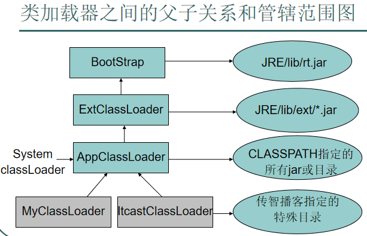

<div class="toc">
<h1>目录</h1>
<ul>
<li><a href="#知识点">知识点</a></li>
<li><a href="#泛型">泛型</a>
<ul>
<li><a href="#了解泛型">了解泛型</a></li>
<li><a href="#1理解泛型重">1.理解泛型【重】</a></li>
<li><a href="#2限定通配符">2.限定通配符</a></li>
<li><a href="#3由c模板函数引入自定义泛型">3.由C++模板函数引入自定义泛型</a></li>
<li><a href="#4泛型练习题">4.泛型练习题</a></li>
<li><a href="#5泛型参数的类型推断难">5.泛型参数的类型推断【难】</a></li>
</ul>
</li>
<li><a href="#反射">反射</a>
<ul>
<li><a href="#1反射实现框架的功能">1.反射实现框架的功能</a></li>
<li><a href="#2数组的反射">2.数组的反射</a></li>
<li><a href="#3用反射方式执行某个类中的main方法">3.用反射方式执行某个类中的main方法</a></li>
<li><a href="#4hashcode方法与hashset类">4.hashCode方法与HashSet类</a></li>
<li><a href="#5hashset造成的内存泄漏重">5.HashSet造成的内存泄漏【重】</a></li>
</ul>
</li>
<li><a href="#反射内省">反射👉内省</a>
<ul>
<li><a href="#1内省">1.内省</a></li>
<li><a href="#2内省综合案例">2.内省综合案例</a></li>
</ul>
</li>
<li><a href="#代理">代理</a>
<ul>
<li><a href="#1理解代理">1.理解代理</a></li>
<li><a href="#2代理架构图">2.代理架构图</a></li>
<li><a href="#3aop原理-代理proxy">3.aop原理-代理proxy</a></li>
<li><a href="#4动态代理介绍">4.动态代理介绍</a>
<ul>
<li><a href="#cglib和jdk实现动态代理的区别">cglib和jdk实现动态代理的区别</a></li>
</ul>
</li>
</ul>
</li>
<li><a href="#位运算符详解实例">位运算符详解实例</a></li>
<li><a href="#设计模式">设计模式</a></li>
<li><a href="#jvm">JVM</a></li>
<li><a href="#类加载器">类加载器</a>
<ul>
<li><a href="#1类加载器">1.类加载器</a></li>
<li><a href="#2类加载器之间的关系">2.类加载器之间的关系</a></li>
<li><a href="#3类加载器的委托机制">3.类加载器的委托机制</a></li>
<li><a href="#4自定义类加载器">4.自定义类加载器</a></li>
</ul>
</li>
<li><a href="#多线程">多线程</a></li>
<li><a href="#学习资源">学习资源</a></li>
</ul>
</div>

---

### 知识点
- [Java 基础总结](src/basic/README.md)
- [Enum 枚举](src/enum_s)
- [Generics 泛型](src/generics)
- [ArrayList](src/arraylist)
- [多线程](src/aop/thread)
- [HashMap与HashTable区别](src/basic/HashMap与HashTable区别.md)
- [char 类型](src/acer/char类型.md)
- [静态成员](src/acer/静态成员.md)
- [Oauth 认证协议原理](src/acer/Oauth认证协议原理.md)
- [onSaveInstanceState源码](src/acer/onSaveInstanceState源码.md)
- [RAM和ROM的区别](src/acer/RAM和ROM的区别.md)
- [Token 产生的意义](src/acer/Token产生的意义.md)
- [编译时和运行时](src/acer/编译时和运行时.md)
- [迭代开发的时候如何向前兼容新旧接口](src/acer/迭代开发的时候如何向前兼容新旧接口.md)
- [注解开发](src/annotation)
- [AOP 基本原理(附图)](src/aop/aopframework)

### 泛型
#### 了解泛型
- ArrayList<E>类定义和 ArrayList<Integer> 类引用中涉及如下术语:
    - 整个称为 ArrayList<E>泛型类型
    - ArrayList<E>中的E称为类型变量或类型参数
    - 整个 ArrayList<Integer> 称为参数化的类型
    - ArrayList<Integer>中的 Integer 称为类型参数的实例或实际类型参数
    - ArrayList<Integer>中的<>念着 typeof
    - ArrayList 称为原始类型
- 参数化类型与原始类型的兼容性:
    - 参数化类型可以引用一个原始类型的对象,编译报告警告,例如,Collection<String> c= new Vector(); 可不可以,不就是编译器一句话的事吗?
    - 原始类型可以引用一个参数化类型的对象,编译报告警告,例如,Collection c= new Vector<String>(); ∥原来的方法接受一个集合参数,新的类型也要能传进去
- 参数化类型不考虑类型参数的继承关系:
Vector<String> v= new Vector<Object>();∥错误!
Vector<Object> v= new vector<String>();∥也错误!
- 在创建数组实例时,数组的元素不能使用参数化的类型,例如,下面语句有错误
 Vector<Integer> vectorList[]=new Vector<Integer>[10];
- 思考题:下面的代码会报错误吗?
```java
Vector v1 = new Vector<String>():
Vector<Object> v= v1;
```

#### 1.理解泛型【重】
泛型是提供给 javac 编译器使用的,可以限定集合中的输入类型,让编译器挡住源程序中的非法输入,
编译器编译带类型说明的集合时会去除掉“类型”信息,使程序运行效率不受影响,对于参数化的泛型类型, getClass()方法的返回值和原始类型完全一样。
由于编译生成的字节码会去掉泛型的类型信息,只要能跳过编译器,就可以往某个泛型集合中加入其它类型的数据,例如,用反射得到集合,再调用其add方法即可。

#### 2.限定通配符
- 限定通配符的上边界: 协变
    - 正确:Vector<? extends Number> x=new Vector<Integer>(),
    - 错误:Vector<? extends Number> x=new Vector<String>()
- 限定通配符的下边界: 逆变
    - 正确:Vector<? super Integer> x=new Vector<Number>(),
    - 错误:Vector<? super Integer> x=new Vector<Byte>()
- 提示 : 限定通配符总是包括自己

#### 3.由C++模板函数引入自定义泛型
- 如下函数的结构很相似,仅类型不同:
```java
int add(int x, int y)
    return x+y.
}
```
```java
float add(float x, float y)
    return x+y.
}
```
```java
double add(double x, double y)
    return x+y.
}
```
- C++用模板函数解决,只写一个通用的方法,它可以适应各种类型,示意代码如下:
```java
template<class T>
   T Edd(T x,T y)
   return (T)(x+y):
}
```

#### 4.泛型练习题
- 编写一个泛型方法，自动将Object类型的对象转换成其他类型。
- 定义一个方法，可以将任意类型的数组中的所有元素填充为相应类型的某个对象。
- 采用自定泛型方法的方式打印出任意参数化类型的集合中的所有内容。
    - 在这种情况下，前面的通配符方案要比范型方法更有效，当一个类型变量用来表达两个参数之间或者参数和返回值之间的关系时，即同一个类型变量在方法签名的两处被使用，
    或者类型变量在方法体代码中也被使用而不是仅在签名的时候使用，才需要使用范型方法。
- 定义一个方法，把任意参数类型的集合中的数据安全地复制到相应类型的数组中。
- 定义一个方法，把任意参数类型的一个数组中的数据安全地复制到相应类型的另一个数组中。

#### 5.泛型参数的类型推断【难】
- 编译器判断范型方法的实际类型参数的过程称为类型推断，类型推断是相对于知觉推断的，其实现方法是一种非常复杂的过程。
- 根据调用泛型方法时实际传递的参数类型或返回值的类型来推断，具体规则如下：
    - 当某个类型变量只在整个参数列表中的所有参数和返回值中的一处被应用了，那么根据调用方法时该处的实际应用类型来确定，这很容易凭着感觉推断出来，即直接根据调用方法时传递的参数类型或返回值来决定泛型参数的类型，例如：
	 swap(new String[3],3,4)       static <E> void swap(E[] a, int i, int j)
    - 当某个类型变量在整个参数列表中的所有参数和返回值中的多处被应用了，如果调用方法时这多处的实际应用类型都对应同一种类型来确定，这很容易凭着感觉推断出来，例如：
	 add(3,5)    static <T> T add(T a, T b) 
    - 当某个类型变量在整个参数列表中的所有参数和返回值中的多处被应用了，如果调用方法时这多处的实际应用类型对应到了不同的类型，且没有使用返回值，这时候取多个参数中的最大交集类型，例如，下面语句实际对应的类型就是Number了，编译没问题，只是运行时出问题：
	 fill(new Integer[3],3.5f)    static <T> void fill(T[] a, T v) 
    - 当某个类型变量在整个参数列表中的所有参数和返回值中的多处被应用了，如果调用方法时这多处的实际应用类型对应到了不同的类型， 并且使用返回值，这时候优先考虑返回值的类型，例如，下面语句实际对应的类型就是Integer了，编译将报告错误，将变量x的类型改为float，对比eclipse报告的错误提示，接着再将变量x类型改为Number，则没有了错误：
	 int x =(3,3.5f)    static <T> T add(T a, T b) 
    - 参数类型的类型推断具有传递性，下面第一种情况推断实际参数类型为Object，编译没有问题，而第二种情况则根据参数化的Vector类实例将类型变量直接确定为String类型，编译将出现问题：
	copy(new Integer[5],new String[5])  static <T> void copy(T[] a,T[]  b);
	copy(new Vector<String>(), new Integer[5])  static <T> void copy(Collection<T> a , T[] b);


### 反射
> [Reflect Code](src/reflect_s)
#### 1.反射实现框架的功能
- 框架与框架要解决的核心问题
    - 我做房子卖给用户住，由用户自己安装门窗和空调，我做的房子就是框架，用户需要使用我的框架，把门窗插入进我提供的框架中。
      框架与工具类有区别，工具类被用户的类调用，而框架则是调用用户提供的类。
- 框架要解决的核心问题
    - 我在写框架（房子）时，你这个用户可能还在上小学，还不会写程序呢？我写的框架程序怎样能调用到你以后写的类（门窗）呢？
    - 因为在写才程序时无法知道要被调用的类名，所以，在程序中无法直接new 某个类的实例对象了，而要用反射方式来做。
- 综合案例
    - 先直接用new  语句创建ArrayList和HashSet的实例对象，演示用eclipse自动生成 ReflectPoint类的equals和hashcode方法，比较两个集合的运行结果差异。
    - 然后改为采用配置文件加反射的方式创建ArrayList和HashSet的实例对象，比较观察运行结果差异。
    - 引入了 Eclipse 对资源文件的管理方式的讲解。

#### 2.数组的反射
- 具有相同维数和元素类型的数组属于同一个类型，即具有相同的Class实例对象。
- 代表数组的Class实例对象的getSuperClass()方法返回的父类为Object类对应的Class。
- 基本类型的一维数组可以被当作Object类型使用，不能当作Object[]类型使用；非基本类型的一维数组，既可以当做Object类型使用，又可以当做Object[]类型使用。
- Arrays.asList()方法处理int[]和String[]时的差异。
- Array工具类用于完成对数组的反射操作。
- 思考题：怎么得到数组中的元素类型？

#### 3.用反射方式执行某个类中的main方法
- 目标：
写一个程序，这个程序能够根据用户提供的类名，去执行该类中的main方法。用普通方式调完后，大家要明白为什么要用反射方式去调啊？
- 问题：
启动Java程序的main方法的参数是一个字符串数组，即public static void main(String[] args)，通过反射方式来调用这个main方法时，如何为invoke方法传递参数呢？
按jdk1.5的语法，整个数组是一个参数，而按jdk1.4的语法，数组中的每个元素对应一个参数，当把一个字符串数组作为参数传递给invoke方法时，
javac会到底按照哪种语法进行处理呢？jdk1.5肯定要兼容jdk1.4的语法，会按jdk1.4的语法进行处理，即把数组打散成为若干个单独的参数。
所以，在给main方法传递参数时，不能使用代码mainMethod.invoke(null,new String[]{“xxx”})，javac只把它当作jdk1.4的语法进行理解，
而不把它当作jdk1.5的语法解释，因此会出现参数类型不对的问题。
- 解决办法：
    - mainMethod.invoke(null,new Object[]{new String[]{"xxx"}});
    - mainMethod.invoke(null,(Object)new String[]{"xxx"}); ，编译器会作特殊处理，编译时不把参数当作数组看待，也就不会数组打散成若干个参数了

#### 4.hashCode方法与HashSet类


#### 5.HashSet造成的内存泄漏【重】
**提示 :**
    (1)通常来说,一个类的两个实例对象用 equals()方法比较的结果相等时,它们的哈希
码也必须相等,但反之则不成立,即 equals 方法比较结果不相等的对象可以有相同的哈希码,
或者说哈希码相同的两个对象的 equals 方法比较的结果可以不等,例如,字符串"BB"和"Aa"
的 equals 方法比较结果肯定不相等,但它们的 hashcode 方法返回值却相等。

    > 简而言之 : equals 相等 ,hashCode() 返回值相等;反之, hashCode() 相等,equals 不一定相等,如字符串比值。

    (2)当一个对象被存储进 HashSet 集合中以后,就不能修改这个对象中的那些参与计算
哈希值的字段了,否则,对象修改后的哈希值与最初存储进 HashSet 集合中时的哈希值就不
同了,在这种情况下,即使在 contains 方法使用该对象的当前引用作为的参数去 HashSet 集
合中检索对象,也将返回找不到对象的结果,这也会导致无法从 HashSet 集合中单独删除当
前对象,从而造成内存泄露。

### 反射👉内省
- [Code](src/reflect_s/内省)
#### 1.内省
- JavaBean是一种特殊的Java类，主要用于传递数据信息，这种java类中的方法主要用于访问私有的字段，且方法名符合某种命名规则。
- 如果要在两个模块之间传递多个信息，可以将这些信息封装到一个JavaBean中，这种JavaBean的实例对象通常称之为值对象（Value Object，简称VO）。这些信息在类中用私有字段来存储，如果读取或设置这些字段的值，则需要通过一些相应的方法来访问，大家觉得这些方法的名称叫什么好呢？JavaBean的属性是根据其中的setter和getter方法来确定的，而不是根据其中的成员变量。如果方法名为setId，中文意思即为设置id，至于你把它存到哪个变量上，用管吗？如果方法名为getId，中文意思即为获取id，至于你从哪个变量上取，用管吗？去掉set前缀，剩余部分就是属性名，如果剩余部分的第二个字母是小写的，则把剩余部分的首字母改成小的。
    - setId()的属性名id
    - isLast()的属性名last
    - setCPU的属性名是什么?CPU
    - getUPS的属性名是什么？UPS
总之，一个类被当作javaBean使用时，JavaBean的属性是根据方法名推断出来的，它根本看不到java类内部的成员变量。
- 一个符合JavaBean特点的类可以当作普通类一样进行使用，但把它当JavaBean用肯定需要带来一些额外的好处，我们才会去了解和应用JavaBean！好处如下：
    - 在Java EE开发中，经常要使用到JavaBean。很多环境就要求按JavaBean方式进行操作，别人都这么用和要求这么做，那你就没什么挑选的余地！
    - JDK中提供了对JavaBean进行操作的一些API，这套API就称为内省。如果要你自己去通过getX方法来访问私有的x，怎么做，有一定难度吧？用内省这套api操作JavaBean比用普通类的方式更方便。

#### 2.内省综合案例
- 演示用eclipse自动生成 ReflectPoint类的setter和getter方法。
- 直接new一个PropertyDescriptor对象的方式来让大家了解JavaBean API的价值，先用一段代码读取JavaBean的属性，然后再用一段代码设置JavaBean的属性。
- 演示用eclipse将读取属性和设置属性的流水帐代码分别抽取成方法：
    - 只要调用这个方法，并给这个方法传递了一个对象、属性名和设置值，它就能完成属性修改的功能。
    - 得到BeanInfo最好采用“obj.getClass()”方式，而不要采用“类名.class”方式，这样程序更通用。
- 采用遍历BeanInfo的所有属性方式来查找和设置某个RefectPoint对象的x属性。在程序中把一个类当作JavaBean来看，就是调用IntroSpector.getBeanInfo方法， 得到的BeanInfo对象封装了把这个类当作JavaBean看的结果信息。

---

### 代理
#### 1.理解代理
- 生活中的代理
    - 武汉人从武汉的代理商手中买联想电脑和直接跑到北京传智播客旁边来找联想总部买电脑，你觉得最终的主体业务目标有什么区别吗？基本上一样吧，都解决了核心问题，但是，一点区别都没有吗？从代理商那里买真的一点好处都没有吗？
- 程序中的代理
    - 要为已存在的多个具有相同接口的目标类的各个方法增加一些系统功能，例如，异常处理、日志、计算方法的运行时间、事务管理、等等，你准备如何做？
    - 编写一个与目标类具有相同接口的代理类，代理类的每个方法调用目标类的相同方法，并在调用方法时加上系统功能的代码。 （参看下页的原理图）
    - 如果采用工厂模式和配置文件的方式进行管理，则不需要修改客户端程序，在配置文件中配置是使用目标类、还是代理类，这样以后很容易切换，譬如，想要日志功能时就配置代理类，否则配置目标类，这样，增加系统功能很容易，以后运行一段时间后，又想去掉系统功能也很容易。

#### 2.代理架构图


#### 3.aop原理-代理proxy


#### 4.动态代理介绍
- 要为系统中的各种接口的类增加代理功能，那将需要太多的代理类，全部采用静态代理方式，将是一件非常麻烦的事情！写成百上千个代理类，是不是太累！
- JVM可以在运行期动态生成出类的字节码，这种动态生成的类往往被用作代理类，即动态代理类。
- JVM生成的动态类必须实现一个或多个接口，所以，JVM生成的动态类只能用作具有相同接口的目标类的代理。
- CGLIB库可以动态生成一个类的子类，一个类的子类也可以用作该类的代理，所以，如果要为一个没有实现接口的类生成动态代理类，那么可以使用CGLIB库。
- 代理类的各个方法中通常除了要调用目标的相应方法和对外返回目标返回的结果外，还可以在代理方法中的如下四个位置加上系统功能代码：
    - 1.在调用目标方法之前
    - 2.在调用目标方法之后
    - 3.在调用目标方法前后
    - 4.在处理目标方法异常的catch块中
    
##### cglib和jdk实现动态代理的区别
- CGLib 是一个强大、高性能的Code生产类库,可以实现运行期动态扩展java类,Spring
在运行期间通过 CGlib 继承要被动态代理的类,重写父类的方法,实现AOP面向切面编程
    - JDK 动态代理是面向接口,在创建代理实现类时比 CGLib 要快,创建代理速度快。
    - CGLib 动态代理是通过字节码底层继承要代理类来实现(如果被代理类被
    final关键字所修饰,那么抱歉会失败),在创建代理这一块没有 JDK 动态代
    理快,但是运行速度比JDK动态代理要快。

### 位运算符详解实例
- [位运算符详解实例](src/basic/位运算符详解实例.md)

### 设计模式
- [面向对象](src/design/oo/oo.md)
- [责任链模式](src/design/filter/责任链模式.md)
- [迭代器模式-容器与容器遍历](src/design/filter/容器与容器遍历.md)
- [代理模式](src/design/proxy)
<p>代理模式例子</p>


- [策略模式](src/design/strategy/策略模式.md)

### JVM
- [Java内存模型](src/jvm/basic/Java内存模型.md)
- [JVM运行时数据区](src/jvm/basic/JVM运行时数据区.md)
- [类加载器及双亲委派](src/jvm/类加载器及双亲委派.md)

### 类加载器
##### 1.类加载器
- 简要介绍什么是类加载器和类加载器的作用
- Java虚拟机中可以安装多个类加载器，系统默认三个主要类加载器，每个类负责加载特定位置的类：BootStrap,ExtClassLoader,AppClassLoader
- 类加载器也是Java类，因为其他是java类的类加载器本身也要被类加载器加载，显然必须有第一个类加载器不是不是java类，这正是BootStrap。
- Java虚拟机中的所有类装载器采用具有父子关系的树形结构进行组织，在实例化每个类装载器对象时，
  需要为其指定一个父级类装载器对象或者默认采用系统类装载器为其父级类加载。 

##### 2.类加载器之间的关系


##### 3.类加载器的委托机制
- 当Java虚拟机要加载一个类时，到底派出哪个类加载器去加载呢？
    - 首先当前线程的类加载器去加载线程中的第一个类。
    - 如果类A中引用了类B，Java虚拟机将使用加载类A的类装载器来加载类B。 
    - 还可以直接调用ClassLoader.loadClass()方法来指定某个类加载器去加载某个类。
- 每个类加载器加载类时，又先委托给其上级类加载器。
    - 当所有祖宗类加载器没有加载到类，回到发起者类加载器，还加载不了，则抛ClassNotFoundException，不
    是再去找发起者类加载器的儿子，因为没有getChild方法，即使有，那有多个儿子，找哪一个呢？
    - 对着类加载器的层次结构图和委托加载原理，解释先前将ClassLoaderTest输出成jre/lib/ext目录下的 itcast.jar 包中后，
    运行结果为ExtClassLoader的原因。

##### 4.自定义类加载器
模板方法设计模式 :
- 父类 -> loadClass/findClass/得到class文件转换成 **字节码** -> defineClass()

### 多线程
- [Java中终止（销毁）线程的方法](src/thread_s/Java中终止（销毁）线程的方法.md)

### 学习资源
- Java中级技术教程 http://yun.itheima.com/course/5.html
- Java多线程与并发库高级应用 http://yun.itheima.com/course/37.html