### Java 功底

#### 计算机语言的发展过程
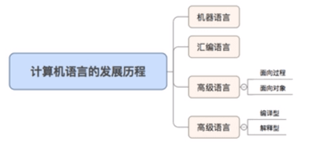
<br>
**Java是一种半编译半解释型的语言。**
#### Java语言特点
1.简单、高效；<br>
2.面向对象；<br>
3.跨平台性（一次编译、到处运行）；<br>
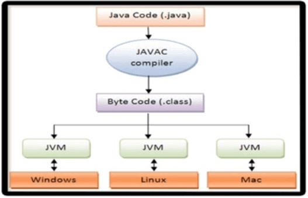
<br>
4.交互式特性；<br>
5.多线程；<br>
6.动态的内存管理；<br>
7.安全性<br>

#### 二、Java 标识符、字面量、数据类型
- 标识符<br>
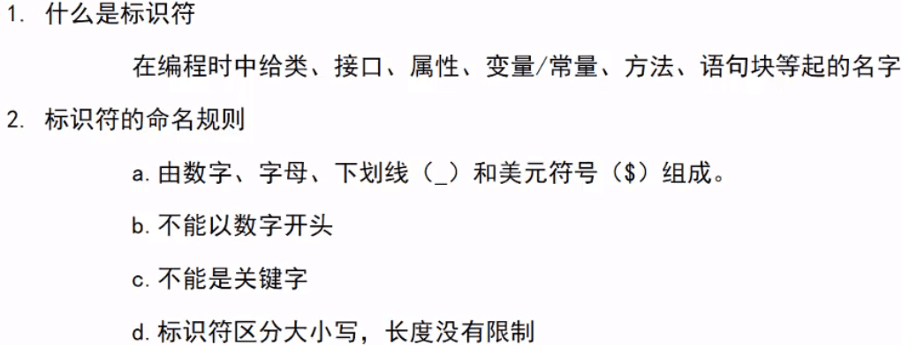<br>
- 分隔符<br>
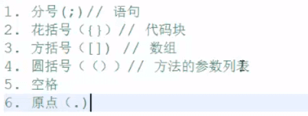<br>
- 关键字<br>
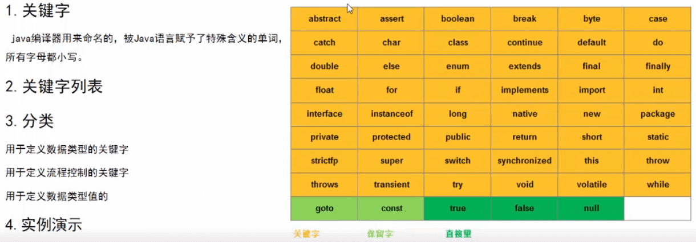<br>
- Java的命名规范<br>
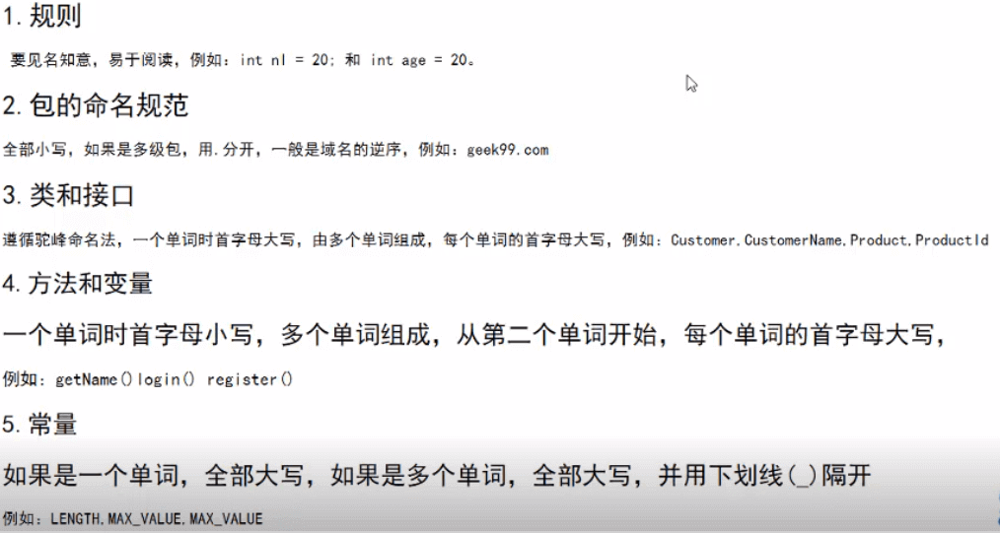<br>
- 注释<br>
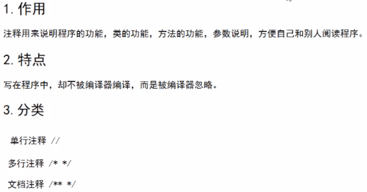<br>
- 变量、常量、字面量<br>
1.什么是变量？ -》 内存里的一段存储单元，有类型、名称和作用域，我们可以通过操作变量名进而操作相应的内存单元。<br>
2.变量的声明  -》 两种方式：类型 变量名称；类型 变量名称 = 值<br>
3.变量的初始化和赋值<br>
4.变量的分类和作用域<br>
局部变量<br>
实例变量 -- 成员变量<br>
类（静态成员.md）变量 static<br>
5.常量 -》 特殊的变量，不变的变量  ； 由 final 修饰，一旦赋值，不能修改 ； 全部大写<br>
6.字面量 ： 给常量或变量赋的值就叫字面量。<br>
- 数据类型<br>
ASCII码是 8位的，用于表示一些英文字母和特殊字符还是可以的，但是如果是汉字或是韩文、日文就不够用了，所以Java用的编码为UNICODE编码，
UNICODE编码是双字节的，16位 -- 即 char 16位<br>
float a=3.14F;// 默认是double类型，需要在3.14后面加上F或f标明它是Float类型<br>
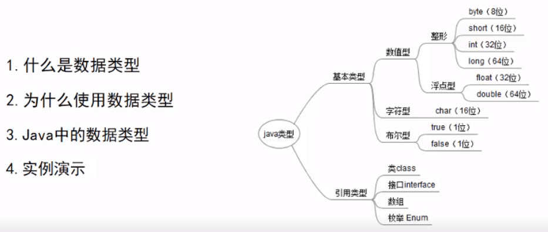<br>
数据类型取值范围计算：<br>
<br>
<br>
补充：char类型取值范围 ：0 - 65535 <br>
数据类型字面量<br>
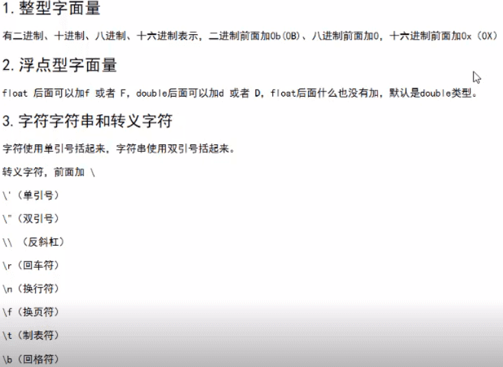<br>
```
int a2 = 0b11011010; // 二进制  0b 或 0B
int a8 = 01213;      // 八进制
int a16 = 0x11fa901; // 十六进制  0x或 0X
```
类型转换 -- 涉及到内存中的【对位】问题，比如说：byte和int相加<br>
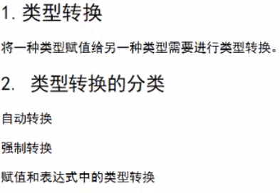<br>
1.布尔类型不能和其他7中数据类型进行相互转换<br>
2.向上转型的顺序：byte -> (short = char) -> int -> long -> float -> double
向下转型：有可能溢出 int j=200;<br> <br>
输出为 -50<br>
如果是 int j=20; 此时byte（水杯大小为-128~127）就放得下，输出正常20！！！<br>
例2：<br>
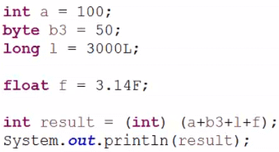<br>
输出为3153 。 精度损失，小数位没有了<br>

#### 三、Java运算符和表达式
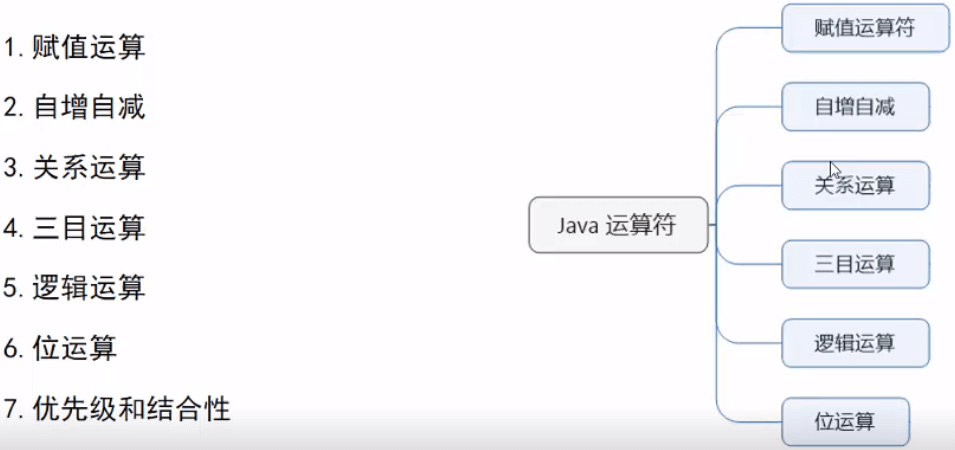<br>
- 赋值运算【重】<br>
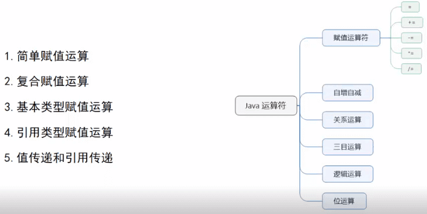<br>
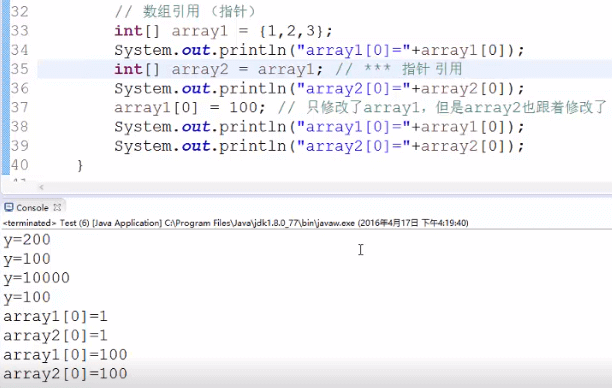<br>
其中，int[] array2=array1; 赋给的是地址（指针）的传递<br>
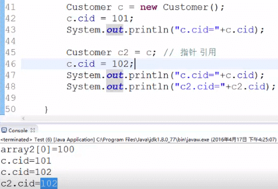<br>
- 算术运算<br>
注意的点：<br>
1./ 是求商的，int a=1/2; 结果为0 ； %是取余运算，int a=1%2; 结果为1。
2.char 进行算术运算时，会转换成 int 类型进行计算, eg:
```
char a = 'a';
char b = 'b';
int c = a + b;
System.out.println("c = "+c); // 输出为 c = 195
```
3.被除数不能是0 -- 抛出异常： java.lang.ArithmeticException: / by zero
4.+ 号在字符串拼接中的应用。
- 自增自减<br>
除了 int 类型以外，其他基本类型也可以使用自增自减 (除了boolean) ：
```
float f= 0.1F;
f++;
double d=3.14D;
d++;
char c = 'c';
c++;
System.out.println("f = "+f);
System.out.println("d = "+d);
System.out.println("c = "+c);
```
运行结果: -- 注意char类型，自增后的值对应的是ASCII码表中的数值！
```
f = 1.1
d = 4.140000000000001
c = d
```
- 关系运算<br>
也叫比较运算<br>
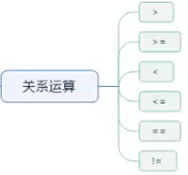<br>
对象的比较：1.比较指针；2.比较内容 equals<br>
- 三目运算符<br>
- 逻辑运算<br>
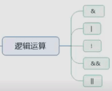 <br>
```
五个运算符
注意一个问题：& 和 | 都会判断 if 中的所有条件！！！
& 逻辑与 所有表达式为真，结果为真
| 逻辑或 有一个表达式为真，结果为真
! 非（取反）
//
&& 短路与
例如：if(A && B && C)
当 A 为真，则依次向后验证，B真则验证C，B假则退出 if 判断进入 else 里。
由此可见，为了程序的效率执行，开发中将容易退出 if 的条件优先放到判断的最前面去判断，而不是用 & 去逐一判断。
参照代码：
    int a = 1, b = 2, c = 3;
    if (a > b && b++ > c) {
        System.out.println("if : a = " + a + " , " + " b = " + b + " , " + " c = " + c);
    } else {
        System.out.println("else : a = " + a + " , " + " b = " + b + " , " + " c = " + c);
    }
    输出： else : a = 1 ,  b = 2 ,  c = 3
    将 if 判断改为 if (a > b & b++ > c) 逻辑与后的结果为：
    输出： else : a = 1 ,  b = 3 ,  c = 3

|| 短路或
例如：if(A || B || C)
当 A 为真，则跳过后面的判断；A假则向后逐一排查，只要有有一个真，则进入 if ，否则 else 。
参照代码：（同上）
if(a<b || b++>c) -> if(a<b | b++>c)
```
- 位运算<br>
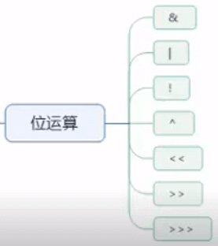 <br>
Demo -> com.ishiqing.modules.java.位运算 <br>
& 与运算、|或运算、^异或运算、~取反运算、<<左移位、>>右移位
>原码、反码、补码

原码：是一个数的本身；
反码：原码取反；
补码：原码取反再+1;
负数在计算机中是以补码形式存在的。
<br>
>计算机为什么要使用补码呢？

首先，根据运算法则我们知道：减去一个正数等于加上一个负数， 即: 1-1 = 1+(-1)， 所以计算机被设计成只有加法而没有减法，
而让计算机辨别”符号位”会让计算机的基础电路设计变得十分复杂，于是就让符号位也参与运算，从而产生了反码。
用反码计算， 出现了”0”这个特殊的数值， 0带符号是没有任何意义的。 而且会有[0000 0000]和[1000 0000]两个编码表示0。
于是设计了补码， 负数的补码就是反码+1，正数的补码就是正数本身，从而解决了0的符号以及两个编码的问题: 用[0000 0000]表示0，用[1000 0000]表示-128。
注意-128实际上是使用以前的-0的补码来表示的， 所以-128并没有原码和反码。
使用补码， 不仅仅修复了0的符号以及存在两个编码的问题， 而且还能够多表示一个最低数。 这就是为什么8位二进制， 使用补码表示的范围为[-128， 127]。
- 优先级和结合性<br>
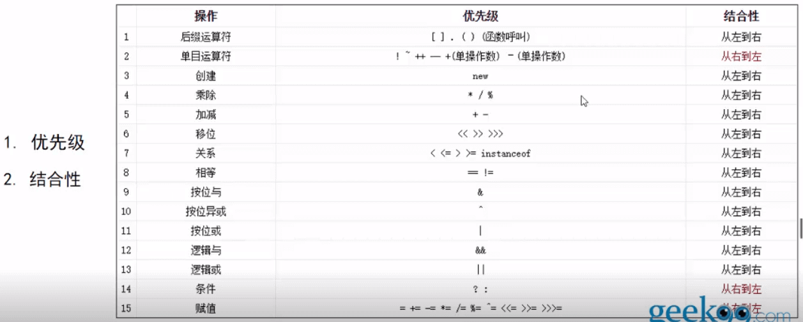<br>
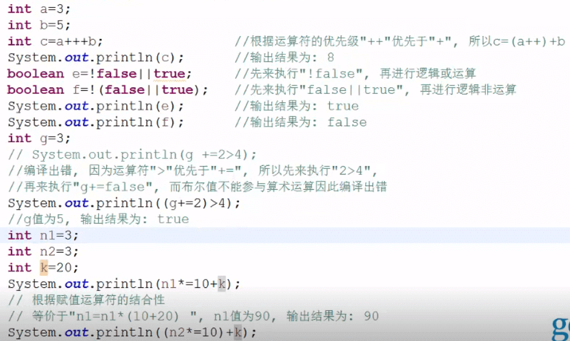<br>

#### 四、流程控制
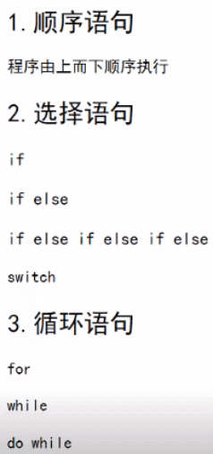<br>
> 分三种：顺序执行、选择、循环<br>

- 顺序执行 -> 比如：方法的调用 <br>
- 选择语句if<br>
1.block 结构 -> {{{...}}}<br>
2.局部变量 -> 方法里面和代码块里面的变量都叫局部变量。<br>
作用域只在代码块内部。
- 循环

#### 五、数组
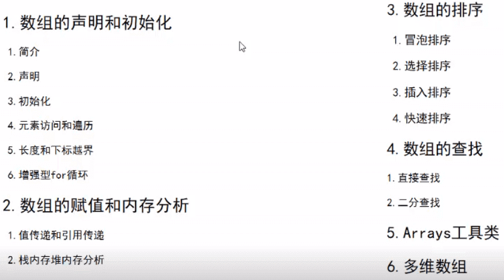<br>
数组是一个集合，用于保存多个值。线性数据结构，前后数据连续。通过索引（下标）对数组进行遍历。
```
int[] a = new int[]{1, 2, 3};
int[] b = {1, 2, 3};
```
- 数组的赋值和内存分析【重】 <br>
1.值传递和引用传递<br>
java中，基本数据类型 都是 值传递；、引用数据类型 是 指针传递。java中的引用数据类型包括 数组（注：数组是对象）和Object
```
int a=1;
int b=a;
a=100;
输出a、b结果为 ： 100 、1 。b值没有变化, b=a 相当于copy了一份。
```
2.内存分析<br>
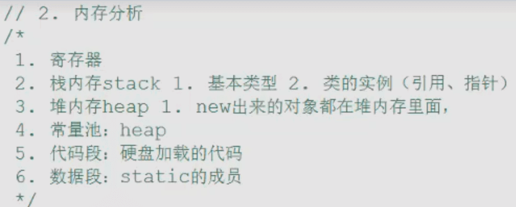<br>
[JAVA中的栈和堆](https://www.cnblogs.com/ibelieve618/p/6380328.html)
- 数组排序--冒泡排序 <br>
示例：com.ishiqing.modules.java.冒泡排序

- 数组排序--冒泡排序
- 数组排序--冒泡排序
- 数组排序--冒泡排序
<br>
<br>


#### 网络通信
> HTTP两种请求方式：get\post

- HTTP请求的格式 <br>
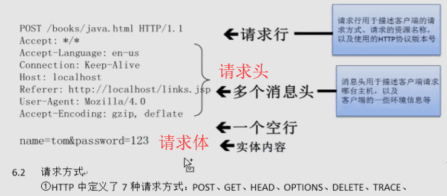 <br>
请求行、请求头、请求体
- HTTP响应的格式 <br>
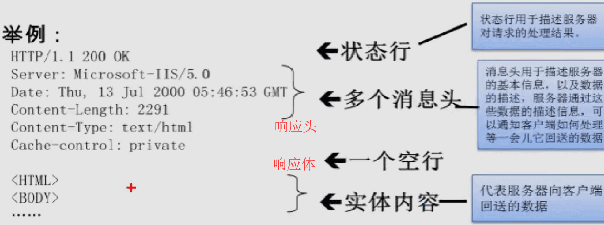 <br>
响应行、响应头、响应体
- [Volley](http://www.gulixueyuan.com/course/112/task/1697/show)

####